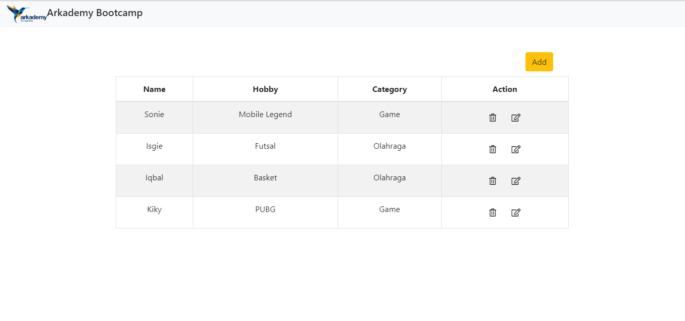
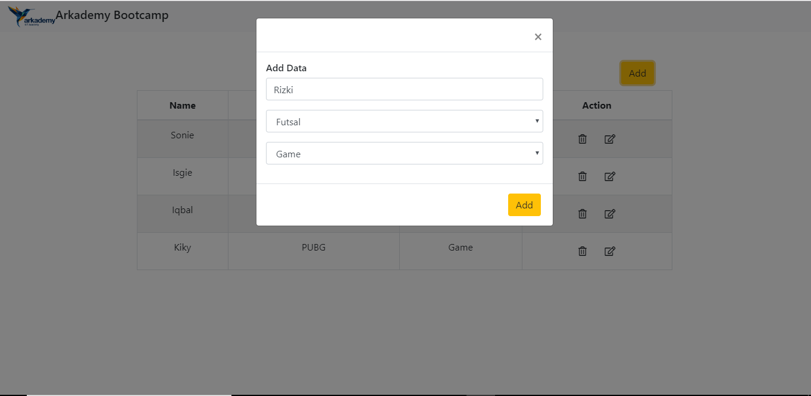
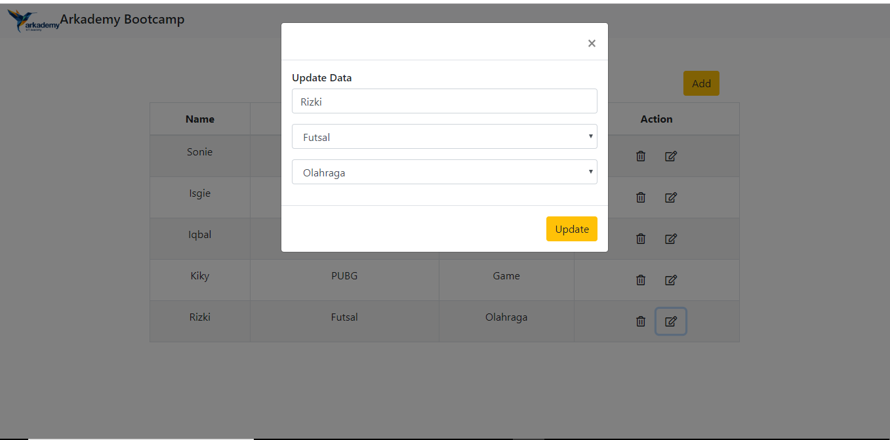
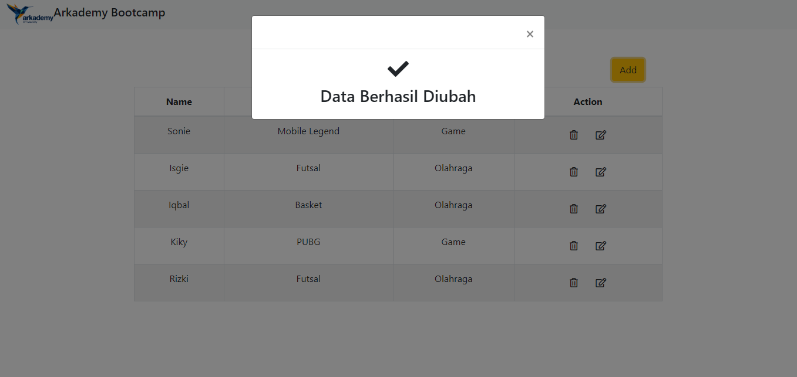
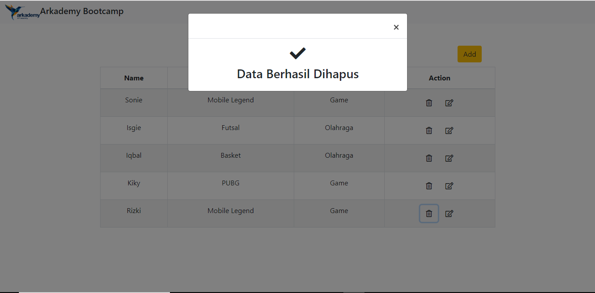

# Petunjuk Penggunaan
1.jawaban untuk soal nomor 1 bernama file biodata.js logika yang digunakan pada file ini yaitu pertama fungsi akan menerima parameter sesuai kriteria soal trus seluruh parameter akan dimasukkan kedalam file object kemudian akan dikonversi kedalam file json. kegunaan dari file json sendiri yaitu agar pengiriman file antar aplikasi misalnya restful api menjadi lebih mudah
2. jawaban untuk soal nomor 2 ada pada file validasi.js semua fungsi didalamnya menggunakan regular expression
3. jawaban untuk soal nomor 3 ada file bintang.php pada file ketika saya running di gdbOnline bintang menjadi tidak presisi makanya saya menambahkan " " spasi kosong agar presisi
4. jawaban untk soal nomor 4 ada pada file pohon.php atau pohon.js fungsi didalam file ini menerima parameter berupa tinggi awal pohon dan kemudian jumlah tahun dan akan mengembalikan nilai tinggi pohon setelah n tahun
5. jawaban untuk soal nomor 5 ada pada file seleksi_angka.php fungsi didalam file ini menerima parameter berupa angka random kemudian akan dipisahkan dengan delimiter angka 0 kemudian disatukan kembali lalu.
6. jawaban untuk soal nomor 6 ada pada file tekaTeki.php fungsi didalam file ini menerima parameter berupa n buah teka-teki untuk kemudian dihitung menggunakan requirement yang diminta.
7. -jawaban untuk soal nomor 7.a untuk databasenya tersedia pada file arkademy.sql dan query untuk mengakses data pada database ada pada file query.js
   -jawaban untuk soal nomor 7.b dan 7.c tersedia pada folder 7 disini saya menggunakan bootstrap dan jquery sebagai framework untuk membantu penyelesaian program setiap fungsi crud tersedia pada file crud.php . setiap icon pada aplikasi menggunakan font-awesome 5 maka dari itu untuk melihat icon pada aplikasi harus menggunakan internet. setiap proses yang menggunakan ajax pada aplikasi ditangani pada file proses.php
   - tampilan awal aplikasi berupa
   
   -tampilan tambah data pada aplikasi berupa
   
   -tampilan pesan berhasil tambah data berupa
   
   -tampilan ubah data pada aplikasi berupa
   
   -tampilan pesan ubah data pada aplikasi berupa
   
   -tampilan pesan untuk hapus data pada aplikasi berupa
   
